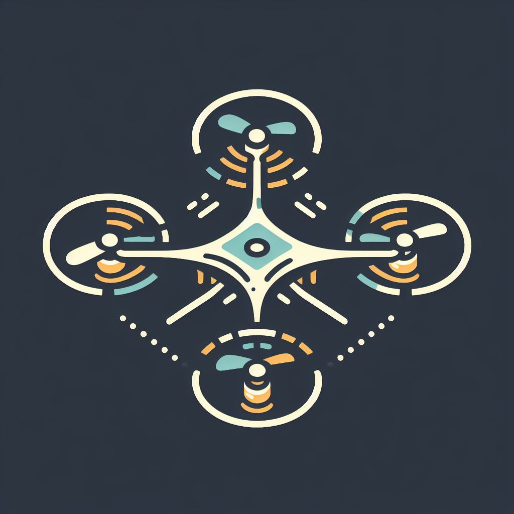
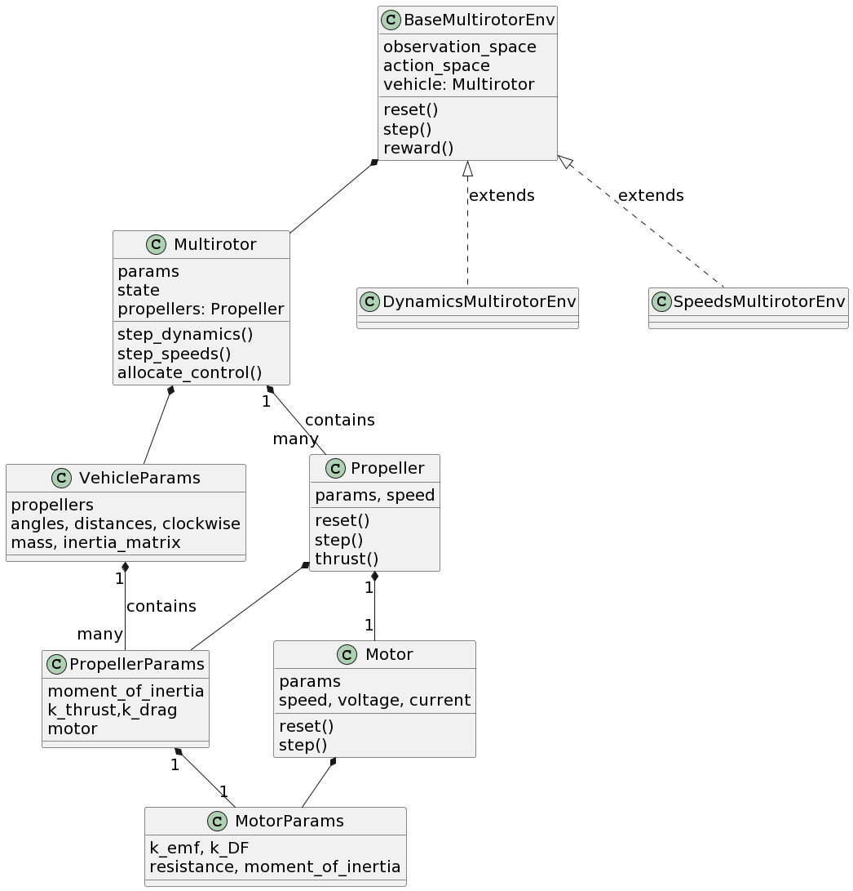
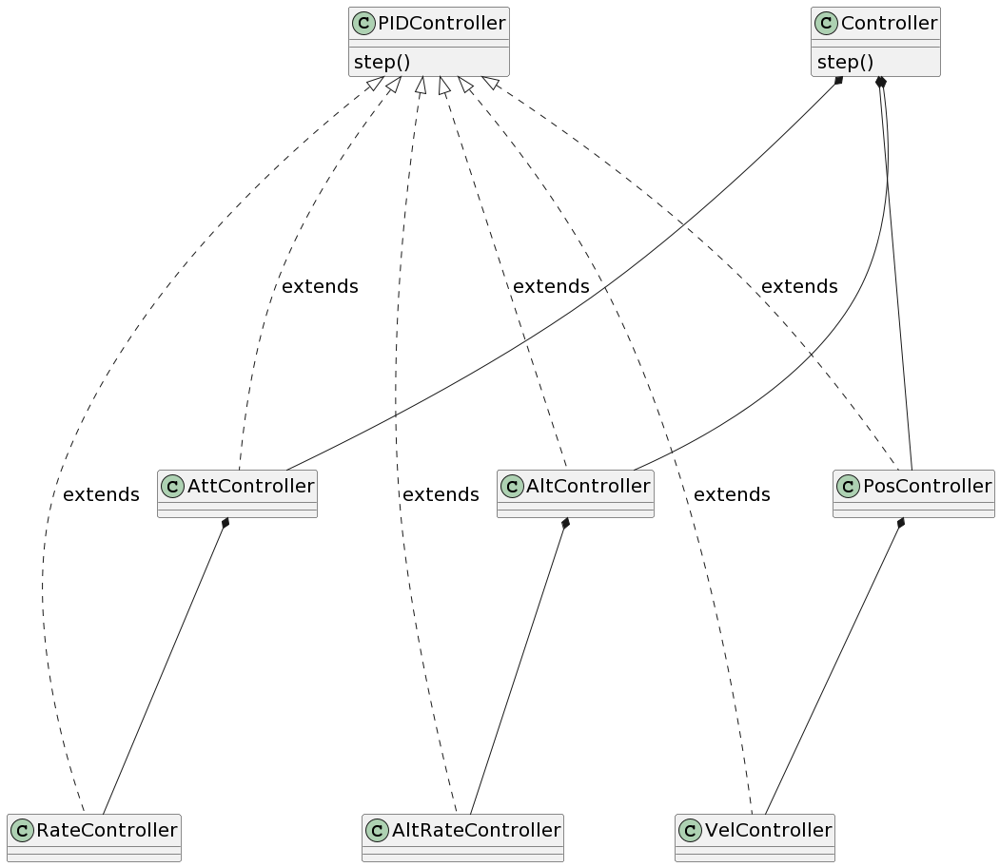

# multirotor

[](https://multirotor.readthedocs.io/en/latest/?badge=latest)



Simulation of multi-rotor unmanned aerial vehicles in python.

This package provides an object-oriented interface for modeling and simulating motors, propellers, and airframe of a UAV. Additionally, an OpenAI gym-compatible environment is provided for Reinforcement Learning experiments.

See the Demo jupyter notebook in the repository for a walkthrough.

Code repository: [Github](https://github.com/hazrmard/multirotor)

Please cite this as:

```
@inproceedings{ahmed2022multirotor,
    title={A high-Fidelity Simulation test-Bed for fault-Tolerant octo-Rotor Control Using Reinforcement Learning},
    author={Ahmed, Ibrahim and Quinones-Grueiro, Marcos and Biswas, Gautam},
    booktitle={2022 IEEE/AIAA 41st Digital Avionics Systems Conference (DASC)},
    year={2022},
    organization={IEEE}
}
```

## Installation

Install from the Python Package Index (PyPI):

```bash
pip install multirotor
```

Or, clone repository and install for development. This will allow you to change the code of the package so the changes show up when you `import multirotor` in other projects.

```bash
git clone https://github.com/hazrmard/multirotor.git
cd multirotor
pip install -e .

# to also install dependencies for building package/documentation
pip install -e .[DEV]
pip install -r docs/requirements.txt
```

## Code organization

The following main classes are available in the code. For simulating the vehicle:


And for simulating control:
